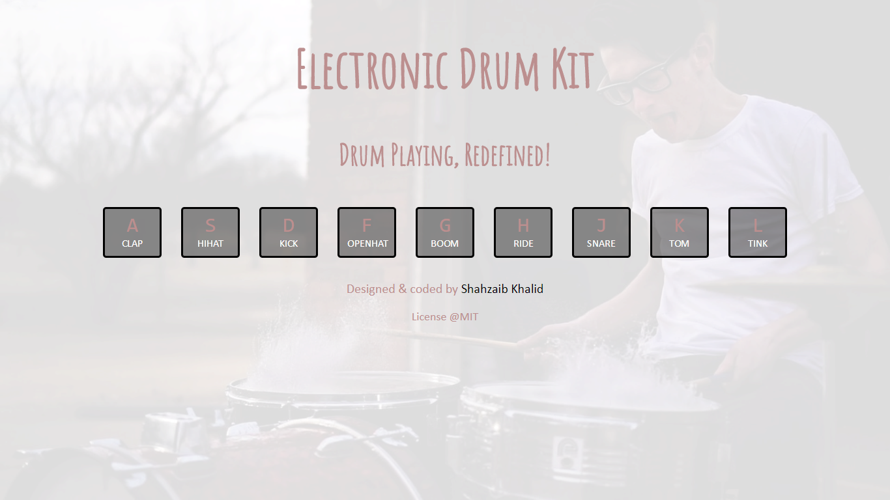

# Electronic Drum Kit
### Drum Playing, Redefined!

An interactive, close to real, drum playing experience, all using HTML, CSS &amp; JavaScript.

## Detail
This project provides an engaging, immersive and personal electronic drum kit playing expereince. It can be played through keyboard keys or by directly clicking or touching the keys.
Efforts have been made to make it minimal, more fun and insanely simple that a 3 years old can play and enjoy with it.

## Design
This is how the design looks like:

Format: ![Electronic Drum Kit]

## Play
You can play the drum kit by clicking [here](https://shahzaibkhalid.github.io/electronic-drum-kit/)

# License
Electronic Drum Kit is licensed under the [MIT License]().

Copyright (c) 2017 Shahzaib Khalid
